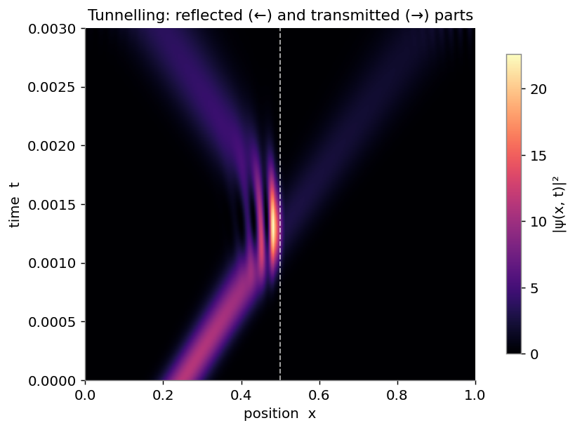
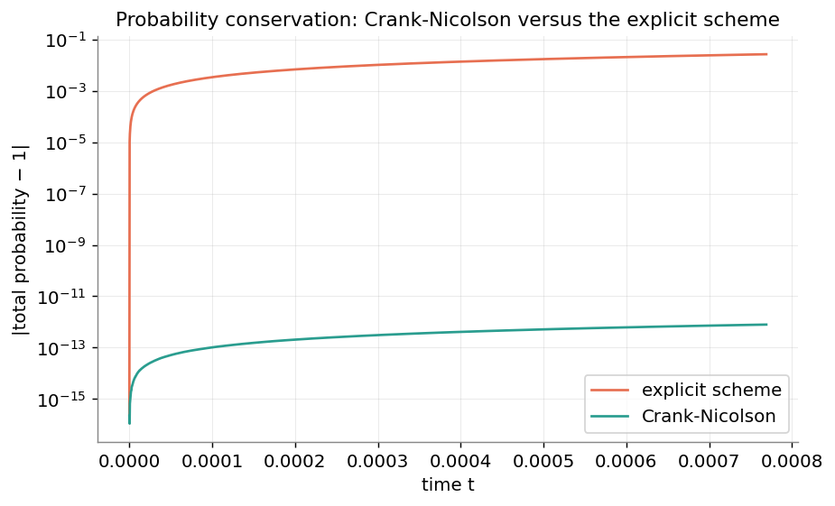
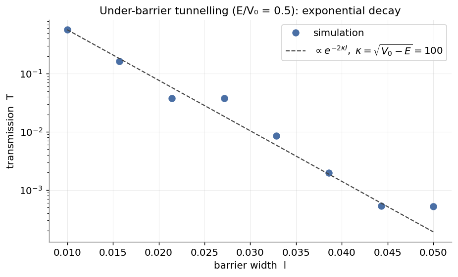

# Quantum wave packets and tunnelling in one dimension

A numerical study of the one-dimensional time-dependent Schrödinger equation,
following a quantum wave packet as it travels, reflects off a potential, and
tunnels through a barrier. The project was carried out for a physics course, to
make the link between the equation and its numerical solution explicit, and is
shared so that it may be read and reused by others studying the same material.

<p align="center">
  
</p>

## Contents

The work is organised around two files:

- **[`tdse_tutorial.ipynb`](tdse_tutorial.ipynb)** — a guided walkthrough that
  states the equation, introduces the two numerical schemes, and works through
  the three cases with figures and commentary.
- **[`schrodinger.py`](schrodinger.py)** — the solver: the initial packet, four
  potentials, the two time integrators, and the diagnostics, written to be read
  against the equations they implement.

## The equation

$$ i\,\frac{\partial \psi}{\partial t} = -\frac{\partial^2 \psi}{\partial x^2} + V(x)\,\psi, \qquad \hbar = 1,\; m = \tfrac12, $$

solved on a box $[0, L]$ with hard walls, starting from a Gaussian packet
$\psi(x, 0) = e^{i k_0 x}\, e^{-(x - x_0)^2 / 2\sigma_0^2}$.

## Selected results

A space-time map of $|\psi(x, t)|^2$, with time increasing upward, summarises the
barrier case in a single figure: the incident packet, its interference with the
reflected wave near the barrier, and the transmitted part continuing beyond it.

<p align="center"></p>

Run with the same time step, the explicit scheme drifts away from a total
probability of one, while Crank-Nicolson conserves it to within rounding error.

<p align="center"></p>

For a barrier higher than the particle's energy, the transmitted probability
decays exponentially with the width, $T \propto e^{-2\kappa l}$ with
$\kappa = \sqrt{V_0 - E}$. The simulation reproduces the analytic slope to within
the packet's finite spread in energy.

<p align="center"></p>

## Using the solver

```python
import numpy as np
import schrodinger as sch

x = np.linspace(0, 1, 256)
dx = x[1] - x[0]

psi0 = sch.gaussian_packet(x, x0=0.25, sigma=0.05, k0=100)
V = sch.barrier(x, height=100**2, width=0.03, center=0.5)

psi = sch.evolve_crank_nicolson(psi0, V, dx, dt=1e-6, n_steps=3000)
reflected, transmitted = sch.reflection_transmission(psi[-1], x, split=0.5)
print(f"reflected {reflected:.2f}, transmitted {transmitted:.2f}")
```

## Repository layout

```
schrodinger-tdse/
├── tdse_tutorial.ipynb   # the guided walkthrough
├── schrodinger.py        # the solver
├── make_figures.py       # regenerates everything in figures/
├── figures/              # rendered figures and the animation
├── requirements.txt
└── LICENSE
```

## Running it

```bash
pip install -r requirements.txt
jupyter notebook tdse_tutorial.ipynb
python make_figures.py
```

## Reference

A. Goldberg, H. M. Schey, J. L. Swartz, *Computer-Generated Motion Pictures of
One-Dimensional Quantum-Mechanical Transmission and Reflection Phenomena*,
American Journal of Physics **35**, 177 (1967).
